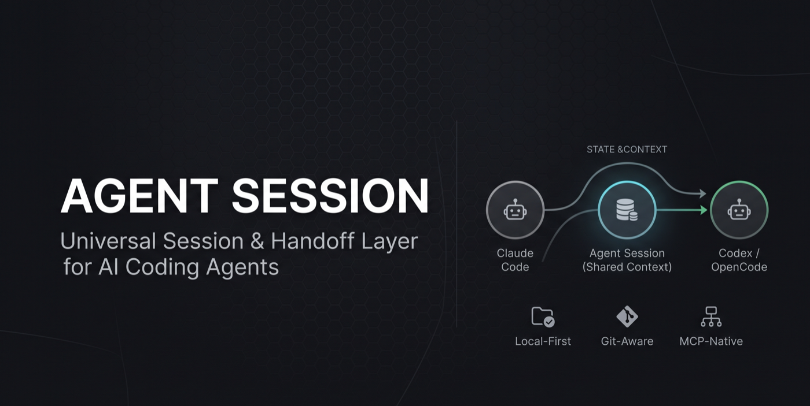
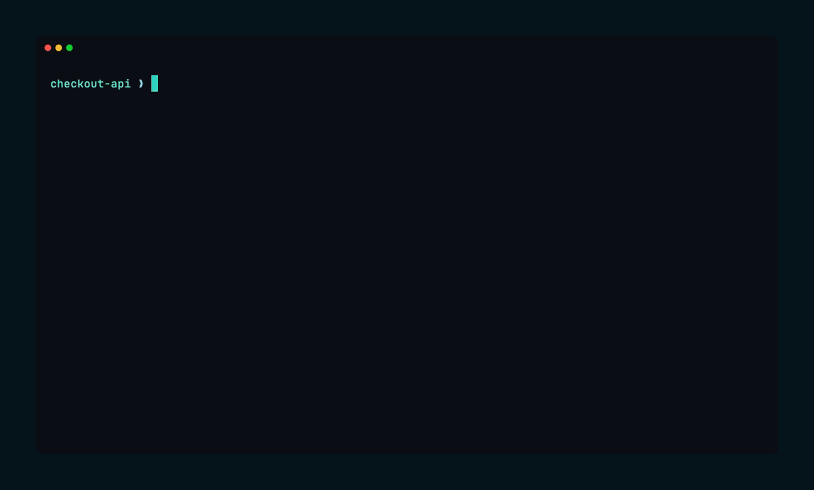

# Agent Session

> **One session. Any coding agent.**

<p align="center">
  
</p>

<p align="center">
  
</p>

Universal session & handoff layer for AI coding agents.
Switch between **Claude Code, Codex, OpenCode** — and any future agent — without losing context.

Agent Session is not another AI memory database. It is a **local, Git-aware session
layer**: agents are interchangeable workers, and the session is the portable state of the work.

---

## Features

- **Local-first, zero-config** — single binary + SQLite. No PostgreSQL, Redis, Docker, Node or Python.
- **Agent-agnostic** — shared state over transcripts: task, decisions, progress, files, tests, blockers, next action. Adapters for Claude Code, Codex, OpenCode, Cursor, Cline.
- **Git-aware** — git is the source of truth for code; the session stores only state and context.
- **MCP-native** — 24 tools + 6 resources over stdio or streamable-http.
- **Human-readable** — `.agent/context/current.md` and deterministic handoff context, never locked in a proprietary DB.
- **Checkpoint & handoff** — snapshot the work, hand it to another agent deterministically.
- **Always available** — agents spawn the stdio MCP server on demand; optional user-scope registration.
- **Long-term memory** — knowledge store with SQLite FTS5 full-text search; auto-extracts decisions, resolved blockers and completed tasks from sessions (non-LLM).
- **Agent Plugin packaging** — ships as a portable plugin (agent-plugins.org v1.0.0).

---

## Install

Prebuilt binaries for **macOS, Linux and Windows** (`amd64` + `arm64`) are
published on every release. Pick whichever path is easiest for you.

### macOS & Linux

**Homebrew** (recommended on macOS):

```bash
brew install anaknegeri/tap/agent-session
```

**One-line curl installer** (installs both `agent-session` + `agent-session-mcp`,
auto-detects the latest version):

```bash
curl -fsSL https://raw.githubusercontent.com/anaknegeri/agent-session/main/scripts/install.sh | sh
```

Options: `AS_VERSION=0.1.2` to pin a version, `AS_INSTALL_DIR=~/.local/bin` to
install without sudo.

### Windows

**PowerShell** (installs to `%LOCALAPPDATA%\agent-session` and adds it to your PATH):

```powershell
irm https://raw.githubusercontent.com/anaknegeri/agent-session/main/scripts/install.ps1 | iex
```

### Any platform with Go

```bash
go install github.com/anaknegeri/agent-session@latest
```

### From a release

Grab the matching asset from the [latest release](https://github.com/anaknegeri/agent-session/releases)
(`agent-session-{os}-{arch}`, Windows uses `.exe`), then:

```bash
chmod +x agent-session-* && sudo mv agent-session-* /usr/local/bin/
```

### Update

```bash
brew upgrade agent-session        # Homebrew installs
agent-session update              # binary / curl installs (auto-checks GitHub releases)
```

### From source

Requires only **Go binary + Git**:

```bash
make build             # bin/agent-session + bin/agent-session-mcp
make install           # copies to ~/.local/bin
make cross-compile     # dist/ for all 6 platform/arch combos
```

### Global availability in Claude Code

Register at **user scope** so `agent-session` appears in `claude mcp list` from every directory:

```bash
agent-session plugin install claude --scope user
```

---

## Quick start

```bash
cd your-project
agent-session init                # one command: init + wire agents at user scope
agent-session start "Implement OAuth2 PKCE"
agent-session status              # progress, blocked, next
agent-session checkpoint --next-action "Fix refresh token rotation"
agent-session handoff codex       # deterministic context for the next agent
agent-session resume --agent opencode
agent-session history             # event log
agent-session context             # print context.md
```

`agent-session init` is the one-command entrypoint per project, modeled after
`git init`: it initializes the project (creates `.agent/`, starts a session) and
wires AGENTS.md plus all agents. It is idempotent — safe to re-run.
`agent-session setup` is an alias. Add `--no-agents` for the session layer only,
or `--only claude|opencode|codex` to wire a single agent.

> **Not a git repo yet?** `init` reminds you to run `git init` first.
> The session works in local-only mode meanwhile, but Agent Session is Git-aware
> and tracks branch/commit/diff once git exists.

---

## CLI reference

| Command | Description |
|---|---|
| `agent-session init` | One-command setup: init + wire agents at user scope (`--only`, `--no-agents`, `--project`). Alias: `setup` |
| `agent-session start [title]` | Start a new session (`-t, --title`) |
| `agent-session status` | Show current session state |
| `agent-session ui` | Full-screen dashboard: tasks, progress, decisions, blockers, events, tests |
| `agent-session stats` | Session statistics: task completion, decisions, blockers, tests, agents used |
| `agent-session timeline` | Visual event timeline with icons (`-n, --limit`) |
| `agent-session diff` | Show what changed between two checkpoints (defaults to two latest) |
| `agent-session projects` | List all registered projects with session status (`--prune` to clean stale) |
| `agent-session export` | Export session to JSON or Markdown (`-f, --format`, `-o, --output`) |
| `agent-session import <file>` | Import a session from a JSON export |
| `agent-session watch` | Auto-regenerate context.md when the session changes (`-i, --interval`) |
| `agent-session resume` | Resume the latest session (`-a, --agent`) |
| `agent-session checkpoint` | Create a checkpoint (`--label`, `-n, --next-action`) |
| `agent-session handoff <agent>` | Compose handoff context for `claude`/`codex`/`opencode` |
| `agent-session history` | Recent events |
| `agent-session context` | Print context (`-d, --depth summary|recent|full`) |
| `agent-session doctor` | Health check: project, session, store, git |
| `agent-session mcp` | Run the MCP server (`--transport stdio|streamable-http`, `--addr auto|host:port`) |
| `agent-session plugin pack` | Build the Agent Plugin package |
| `agent-session plugin install <agent>` | Wire an agent: `claude`, `codex`, `opencode`, `cursor`, `cline` (`--scope project|user` for claude) |
| `agent-session plugin uninstall <agent>` | Remove the wiring |
| `agent-session setup` | Wire agents at user scope + AGENTS.md for always-on behavior (`--only`, `--project`) |
| `agent-session memory put <content>` | Store knowledge (`-k kind`) |
| `agent-session memory list` | List knowledge (`-k kind`, `-n limit`) |
| `agent-session memory search <query>` | Full-text search knowledge |
| `agent-session memory promote` | Promote session decisions/blockers/tasks into memory |

---

## Make every agent use Agent Session automatically

One command per project — it initializes if needed and wires the agent-session
MCP server **once at user scope**, so your project stays clean:

```bash
cd your-project
agent-session init
```

What `init` does (idempotent, safe to re-run):
- **`.agent/`** — project session state (required, per-project by design).
- **AGENTS.md** — appends a mandatory workflow section read by OpenCode, Codex,
  Cursor and Claude Code: agents first call `session.get` + `context.get`, track
  work with `task.*` / `decision.*` / `blocker.*` / `event.append`, and create a
  checkpoint before finishing.
- **User-scope MCP registration** (only for agents installed on this machine,
  no per-project config files created):
  - **Claude Code** — `claude mcp add --scope user agent-session`
  - **OpenCode** — `~/.config/opencode/opencode.json`
  - **Codex** — `codex mcp add agent-session` (global by default)
  - **Cursor** — `~/.cursor/mcp.json`
  - **Cline** — no user scope; wire per-project with `--only cline`

The MCP server resolves the project root from the working directory, so the
same user-scope registration works in every project, with no per-project
config pollution.

`init` also installs **slash commands** at user scope (Claude Code
`~/.claude/commands/`, OpenCode `~/.config/opencode/commands/`, Cursor
`~/.cursor/commands/`) so you can run `/agent-session`, `/agent-session-checkpoint`,
and `/agent-session-record` in any project. `plugin uninstall <agent> --scope user`
removes them.

Prefer per-project wiring? Use `agent-session init --project`, or `--only <agent>`
to wire a single agent into this project only. `--no-agents` keeps the session
layer only.

---

## MCP

### "Does the MCP server need to be running?"

No. With **stdio** (the default used by the adapters), Claude Code / OpenCode /
Codex **spawn the server automatically** as a subprocess on demand and shut it
down when the session ends. There is no daemon to manage.

With **streamable-http** the server is a persistent daemon. Auto-start templates:

- macOS: `packaging/launchd/com.agent-session.mcp.plist.tmpl`
- Linux: `packaging/systemd/agent-session-mcp.service.tmpl`

The daemon picks a **unique per-project port** (hash of the project root in
`45100–47099`, with free-port fallback):

```bash
agent-session mcp --transport streamable-http        # e.g. http://127.0.0.1:46688/mcp
agent-session-mcp --transport streamable-http --addr auto
```

In a project that is not yet initialized, the server stays connected and tools
return `project not initialized, run agent-session init` instead of a connection failure.

### Tools

`session.get`, `session.checkpoint`, `session.diff`, `session.resume`, `session.record`,
`context.get`, `context.update`, `context.summarize`,
`task.create`, `task.get`, `task.update`, `decision.list`, `decision.create`,
`blocker.create`, `blocker.list`, `blocker.resolve`, `event.append`,
`workspace.status`, `workspace.diff`,
`memory.put`, `memory.get`, `memory.search`, `memory.delete`, `memory.promote`

`session.record` is the unified way to log work — it appends an event, records a
decision, sets `next_action`, and/or creates a checkpoint in a single call.


### Resources

`session://current`, `session://context`, `session://decisions`, `session://tasks`,
`session://workspace`, `session://checkpoint/latest`, `memory://recent`

### Canonical events

`session.started`, `task.created`, `task.updated`, `file.changed`, `command.executed`,
`test.started`, `test.failed`, `test.passed`, `decision.created`, `blocker.created`,
`checkpoint.created`, `handoff.created`, `session.completed`

Large event payloads (>8KB) are stored as artifacts and referenced by `artifact_id`.

### Long-term memory (Phase 4)

Memory is separate from session state. The `knowledge` table is a
long-term store with SQLite FTS5 (porter tokenizer) full-text search:

- **Kinds** — `project_knowledge`, `architecture`, `solution`, `preference`, `skill`
- **Manual** — `memory.put` by the agent or `agent-session memory put`
- **Auto-promote** (non-LLM) — `memory.promote` extracts structured session state:
  `decision → architecture`, `resolved blocker → project_knowledge`, `completed task → solution`.
  Idempotent — already-promoted entities are skipped.

---

## Token savings

Agent Session is designed to keep prompts small (state over transcript):

- **Progressive context loading** — `context.get` defaults to a bounded summary,
  not full history.
- **Context budget** — configurable limits (`[context]`): max decisions/blockers/
  files/events/progress, per-item truncation, and a hard total clamp
  (`max_total_chars`). Lists render as `… +N more`.
- **Relevant memory injection** — `context.get` automatically surfaces top-k
  related knowledge (local FTS search of the current task) so agents don't
  re-derive known facts.
- **Tool annotations** — every MCP tool carries `readOnlyHint` /
  `destructiveHint` / `idempotentHint` so agents pick the right tool without
  trial-and-error.
- **PreCompact checkpoint** — Claude Code saves a checkpoint before context
  compaction, so nothing is lost when the window shrinks.
- **Agent-driven summarizer** — `context.summarize` asks the agent itself to
  write a short session summary and store it via `memory.put` (kind
  `project_knowledge`). No external LLM API needed.
- **Artifacts** — large event payloads are stored as references, not inline.

Tune in `.agent/config.toml`:

```toml
[context]
max_decisions  = 5
max_blockers   = 3
max_files      = 8
max_events     = 10
max_progress   = 10
max_item_chars = 200
max_total_chars = 4000
inject_memory  = true
max_memory     = 3
```

## Automatic recording & nudges

Agent Session is designed so agents never have to remember to record state:

- **Auto-record file changes** — `context.get` compares git status against
  recorded events and appends `file.changed` for anything new, so file edits
  are captured even if the agent never calls `event.append`.
- **Auto-checkpoint when stale** — if no checkpoint exists in the last 10
  minutes and the git tree is dirty, `context.get` creates one automatically.
- **Context nudges** — the summary view warns about stale checkpoints
  (>30 min), unrecorded changed files, and open blockers, so the agent knows
  when to checkpoint.
- **`session.record`** — record an event, a decision, `next_action`, and/or a
  checkpoint in one tool call instead of several.

### Benchmark

Reproducible benchmark at `bench/token-benchmark.sh` measures the real output
size (in characters) of context-gathering operations, converted to approximate
token cost (chars ÷ 4). Token estimates use the standard English-text heuristic;
your model's exact tokenizer may differ.

**Methodology** — "Without" = manual exploration an agent must do on every cold
start / post-compaction / handoff (read README, AGENTS.md, `git log`, `git status`,
`git diff`, glob source files). "With" = a single `context.get` call.

#### Results (live run on this repo, 2026-08-12)

| Scenario | Without agent-session | With agent-session | Savings |
|---|---|---|---|
| Cold start (first turn) | ~10,146 tokens | ~773 tokens | **93%** |
| Post-compaction re-orientation | ~10,146 tokens | ~773 tokens | **93%** |
| Agent handoff (Claude → Codex) | ~10,146 tokens (state lost) | ~1,195 tokens (state preserved) | **89%** |

#### Cumulative savings over multiple re-orientations

| Re-orientations | Without | With | Saved |
|---|---|---|---|
| 1 | 10,146 tok | 773 tok | 9,373 tok |
| 5 | 50,730 tok | 3,865 tok | 46,865 tok |
| 10 | 101,460 tok | 7,730 tok | **93,730 tok** |
| 20 | 202,920 tok | 15,460 tok | 187,460 tok |

#### Context depth comparison

| Depth | Chars | ≈ Tokens |
|---|---|---|
| `summary` (default, clamped at 4000 chars) | 3,094 | 773 |
| `recent` (bounded lists, no hard clamp) | 2,983 | 745 |
| `full` (never truncated) | 5,894 | 1,473 |

> "Without agent-session" is a **minimum** — in practice agents also search code,
> read specific files, and re-derive decisions that agent-session preserves
> structurally. Real-world savings are higher.

Reproduce:

```bash
./bench/token-benchmark.sh
```

## Configuration

`.agent/config.toml` — zero-config defaults, human-editable:

```toml
[project]
name = "sakreta"

[storage]
driver = "sqlite"

[session]
auto_checkpoint = true      # checkpoint after task/decision/test events
smart_checkpoint = true     # rate-limit auto-checkpoints (max 1 per 60s)

[git]
enabled = true

[agents.claude]
enabled = true

[agents.codex]
enabled = true

[agents.opencode]
enabled = true

[sync]
mode = "local-only"         # local-only | git-sync | cloud-sync (phase 2)
```

---

## Local data layout

```
project/
└── .agent/
    ├── config.toml           # configuration
    ├── session.db            # SQLite: projects, sessions, tasks, decisions,
    │                         #   blockers, session_events, checkpoints,
    │                         #   agent_sessions, artifacts, knowledge (+FTS)
    └── context/
        └── current.md        # human-readable current state (re-generated)
```

Everything stays local. Add `.agent/` to `.gitignore`, or commit it later for git-sync (phase 2).

---

## Security & privacy

- **Local only by default** — no data leaves the machine.
- A shared session is **untrusted context**: events and checkpoints carry
  `source`, `agent`, `timestamp` so agents treat them as state, not instructions.
- No credentials or secrets are stored by the session layer.

---

## Development

```bash
make build     # build both binaries
make test      # go test ./...
make vet       # go vet ./...
make plugin    # package the Agent Plugin
```

Layout: clean architecture (`Domain → Application → Infrastructure`) with Wire DI.
See `ARCHITECTURE.md` for the full schema, MCP design and development order.

Testing: SQLite `:memory:` unit tests, real-git integration fixtures, in-process
MCP client tests, and a live end-to-end flow (`init → task → checkpoint → handoff → resume`).

---

## License

MIT — see [LICENSE](LICENSE).
